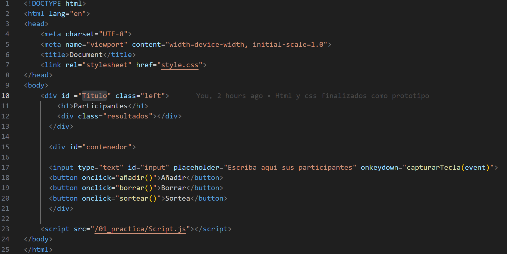
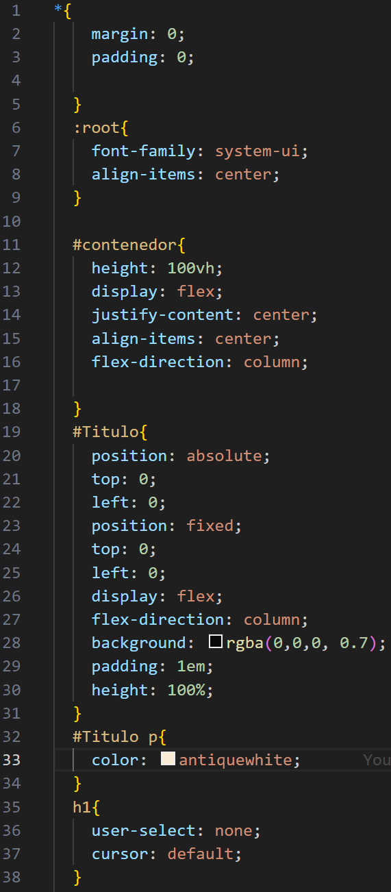
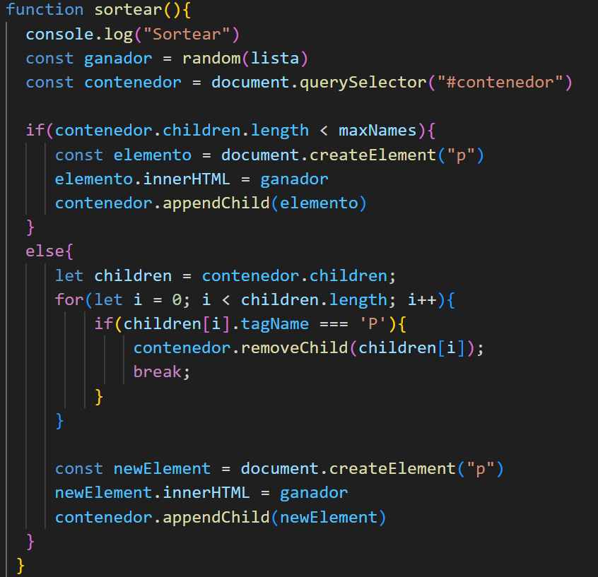
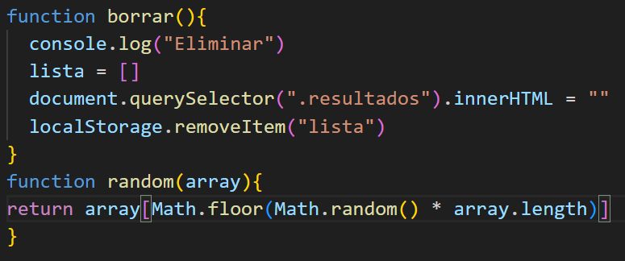
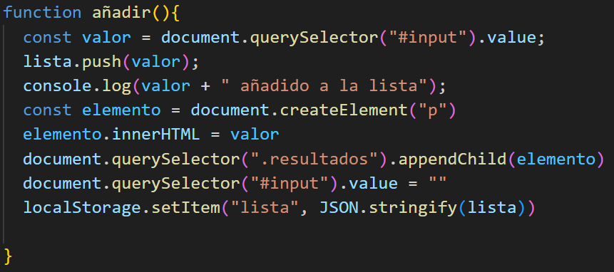

# Examen 1er trimestre BBDD

1º de DAM en ESCAV Granada

Nombre: Lucas Alejandro Sudre Telechea

Fecha: 19/12/2023

El ejercicio realizado es una pagina con un con cepto de juego de azar, los usuarios podrán añadir tantos nombres{ de personas, objetos, etc} como deseén al apretar el boton añadir, y se podrán ir viendo debajo del titulo "Participantes"
al presionar el segundo botón "borrar" se eliminarán los participantes añadidos y restablecerá la lista a 0 para volver a rellenarla, y por ultimo tenemos el botón de sortear, el cual eligirá de manera aleatoria 1 de los participantes y lo escribirá en la parte inferior de la pagina, si se presiona multiples veces, se irán generando más "ganadores", hasta que lleges a un máximo de 5 y emperán a reemplazarse los antiguos por los más recientes.

La parte más básica es la de HTML:

En el cual podemos observar los contenedores que actuan como el esqueleto de la página.

Despues procedemos con CSS:

En donde podemos ver todo lo que se necesita para organizar y acomodar algunas secciones del proyecto.

y por último veremos el JS:
Donde podemos ver la funcionalidad de los botones por ejemplo:

La función de mostrar los ganadores.

El mecanismo de borrar.

Y el de añadir los participantes de la lista.